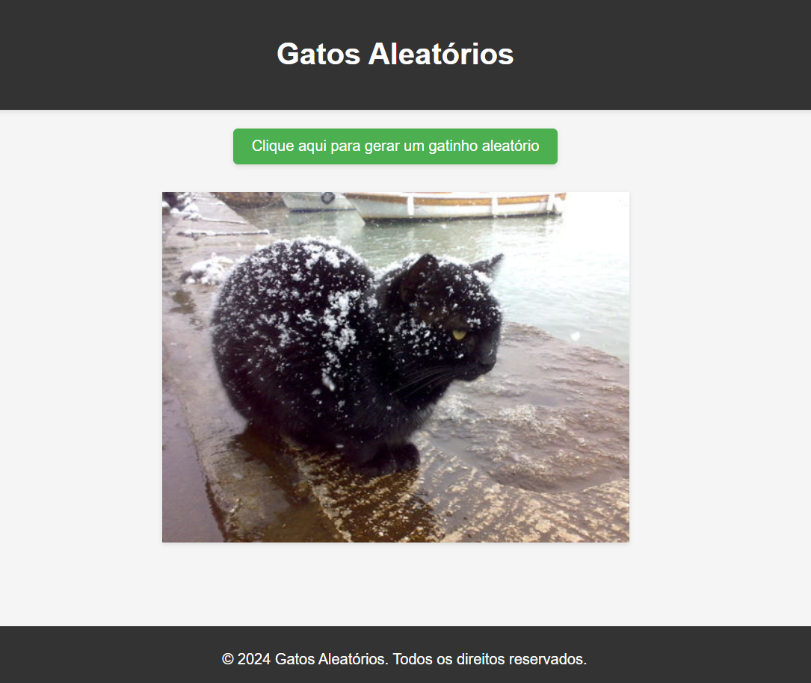

# Random Cats

## História do Projeto
Um amigo me enviou um Reels no Instagram de um rapaz que criou um site de TCC no qual se clicava em um botão e mostrava uma foto aleatória de cachorros. Foi então que tive a brilhante ideia de fazer o mesmo, porém com gatos, e assim nasceu este projeto.

## Sobre o Projeto
O Random Cats é um projeto simples que permite aos usuários clicarem em um botão para ver fotos aleatórias de gatos. Utilizando a API pública do TheCatAPI.

## Foto e Link da Aplicação
[Clique aqui para ver acessar a aplicação](https://isaac-yuri.github.io/random_cats/)

## Tecnologias Utilizadas
- HTML
- CSS
- JavaScript
- [TheCatAPI](https://thecatapi.com/)

## Autor
[Isaac Yuri](https://github.com/Isaac-Yuri)

## Licença
Este projeto está licenciado sob a [Licença MIT](LICENSE).
